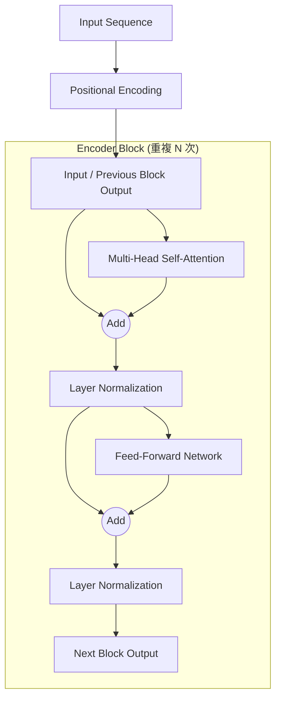

# Transformer模型 (Encoder)學習筆記

## 1. 什麼是 Seq2seq 模型？
**Seq2seq (Sequence to Sequence)** 模型的特徵是輸入一個序列，輸出也是一個序列，且**輸出的長度由機器自行決定**。

### 常見應用場景：
*   **語音辨識/翻譯**：將聲音訊號轉為文字，或直接翻譯成另一種語言。
*   **機器翻譯**：如中翻英，輸入與輸出長度不固定。
*   **聊天機器人**：對話生成。
*   **NLP 任務**：摘要生成、情感分析、語法剖析（Grammar Parsing）。
*   **非典型任務**：多標籤分類（Multi-label Classification）、目標檢測（Object Detection）。

---

## 2. Transformer 架構概覽
Transformer 是一個典型的 Seq2seq 模型，主要由 **編碼器（Encoder）** 與 **解碼器（Decoder）** 組成。

### Encoder 的基本流程：
1.  **輸入一排向量 (Input Embedding)，最后输出一排向量**
2.  **位置編碼 (Positional Encoding)**：由於 Self-Attention 無法辨識位置，需額外加上位置資訊。
3.  **重複 N 次的 Block**：每個 Block 包含 Self-Attention 與前饋網路（Feed-forward）。

---

## 3. Encoder Block 內部組件詳解

### A. 自注意力機制 (Self-Attention)
*   **功能**：考慮整個序列的資訊，輸出經過加權後的向量序列。
    *   举个例子：当你输入一个序列，比如苹果，机器是不知道到底是吃的苹果还是指苹果手机，所以他需要参考输出的全部内容才能判断这个“苹果”是什么意思

*   **多頭注意力 (Multi-head Attention)**：Transformer 實際使用的是多頭版本，能學習不同子空間的資訊。
    *   在**Self-Attention**上更进一步，不仅仅是看一遍，而是带着好几双眼睛从都多个维度观察输入的向量序列

### B. 殘差連接 (Residual Connection / Add)
*   **操作**：將 Block 的輸入直接與輸出相加（$Input + Output$）。
*   **目的**：有助於深層網路的訓練，在架構圖中標示為「Add」。

### C. 層歸一化 (Layer Normalization / Norm)
*   **計算方式**：對**同一個樣本中不同維度**的值計算平均值與標準差，進行歸一化。
*   **特性**：不需要考慮 Batch 的資訊。
*   **順序爭議**：原始論文採用 **Post-norm**（先 Add 再 Norm），但後續研究發現 **Pre-norm**（先 Norm 再運算）效果往往更好。

### D. 前饋網路 (Feed-Forward Network)
*   在 Self-Attention 之後，會經過一個全連接網路（Fully Connected Network）處理向量。

---

## 4. Transformer Encoder 結構圖 

---

## 5. 補充知識
*   **為什麼不用 Batch Norm？** 在 Transformer 中，Layer Normalization 的表現通常優於 Batch Normalization。
*   **模型靈活性**：雖然原始架構被視為標準，但其設計並非最優（Optimal），開發者可以根據任務調整組件順序或規範化方式。

---