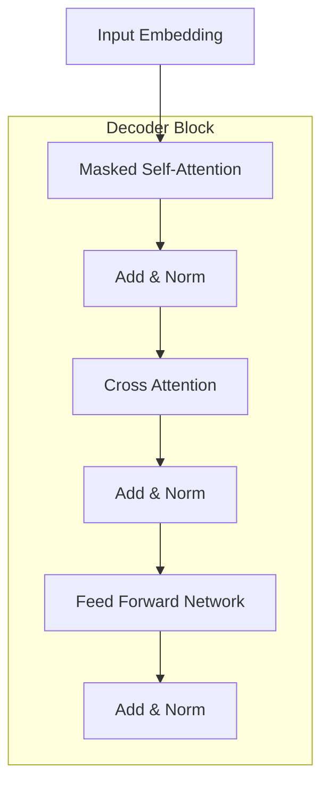
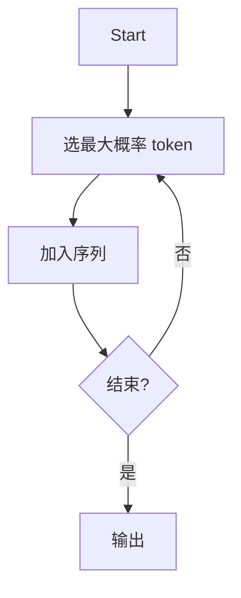

# Transformer学习笔记（Decoder / Training / Decoding / Tricks）

---

# 1. Decoder 机制（重点）

## 1.1 Autoregressive（自回归生成）

核心思想：

- 输出是“一个一个生成”的

$$
\text{START} \rightarrow \text{机} \rightarrow \text{器} \rightarrow \text{学} \rightarrow \text{习} \rightarrow \text{END}
$$

解释：

- 每一步都依赖之前生成的结果

---

每一步：

- 输入：之前生成的 token
- 输出：下一个 token 的概率分布

数学本质：

$$
P(y_1, y_2, \ldots, y_n) = \prod_t P(y_t \mid y_{<t}, x)
$$

解释：

- 整个句子概率 = 条件概率连乘

---

## 1.2 Masked Self-Attention

问题：

- Decoder 不能看到未来信息

解决：

- 使用 Mask

$$
\begin{bmatrix}
\checkmark & 0 & 0 & 0 \\
\checkmark & \checkmark & 0 & 0 \\
\checkmark & \checkmark & \checkmark & 0 \\
\checkmark & \checkmark & \checkmark & \checkmark
\end{bmatrix}
$$

公式：

$$
\mathrm{Attention}(Q, K, V) = \mathrm{softmax}\left(\frac{QK^T}{\sqrt{d}} + \mathrm{Mask}\right)V
$$

---

## 1.3 Decoder Block 结构



---

## 1.4 Cross Attention（核心概念）

$$
\mathrm{Attention}(Q_{\text{decoder}}, K_{\text{encoder}}, V_{\text{encoder}})
$$

### 1.4.1 核心思想

- Decoder 在生成时查询 Encoder

---

### 1.4.2 计算过程

$$
\text{score} = QK^T
$$

$$
\alpha = \text{softmax}(score)
$$

$$
\text{output} = \alpha V
$$

---

### 1.4.3 直观理解

- “生成当前词 → 去输入句子找信息”

---

## 1.5 Stop Token

$$
\langle EOS \rangle 或者 \langle END \rangle
$$

- 表示结束符号

---

## 1.6 AT vs NAT

---

### 1.6.1 Autoregressive（AT，自回归）

$$
P(y_1,...,y_n) = \prod_t P(y_t \mid y_{<t}, x)
$$

---

#### 这公式在说什么？

👉 每一个词，都依赖：
- 输入句子 x
- 之前已经生成的所有词 y₁...yₜ₋₁

👉 用人话说：

> “我现在要说这个词，我必须看我前面说了什么”

---

#### 生成过程（一步一步）

```text
START → 我 → 爱 → 你 → END
```

- 第一步：生成「我」
- 第二步：基于「我」生成「爱」
- 第三步：基于「我 爱」生成「你」

👉 每一步都依赖历史 → 不能跳

---

#### ✅ 优点（为什么它这么强）

- 能理解上下文（语义连贯）
- 句子更自然
- 当前主流（GPT / ChatGPT）

---

#### ❌ 缺点

- 不能并行（慢）
- 一步错 → 后面全错（error propagation）

---

### 1.6.2 Non-Autoregressive（NAT，非自回归）

$$
P(y_1,...,y_n) \approx \prod_t P(y_t \mid x)
$$

---

#### 这公式在说什么？

👉 每个位置的词：
**只看输入 x，不看其他词**

👉 用人话说：

> “我每个位置都独立生成，不管别人”

---

#### 生成方式（一次完成）

```text
一次输出：我 爱 你
```

👉 所有词同时生成（并行）

---

#### ✅ 优点

- 非常快（可以GPU并行）
- 适合工业（机器翻译）

---

#### ❌ 缺点

👉 **Multi-modality（多解问题）**

---

### 1.6.3 为什么 NAT 会出问题？

---

#### 例子

```text
输入：I love you
```

正确输出可能是：

```text
我爱你
我喜欢你
```

👉 两种都对！

---

#### ❗ 问题来了

NAT 假设：

$$
y_1, y_2, y_3 \text{ 相互独立}
$$

但实际上：

👉 “我 + 爱 + 你”是强绑定的组合！

---

#### NAT 可能生成：

```text
我 喜欢 爱 ❌
```

👉 因为：
- 第2个词选了“喜欢”
- 第3个词选了“爱”

👉 它们没有“协调”

---

#### 本质问题总结

👉 NAT 做不到：

- 词与词之间的依赖
- 句子的整体一致性

---

###  一句话总结

👉 AT：

**一步一步生成 → 准但慢**

👉 NAT：

**一次全部生成 → 快但容易错**

---

# 2. 训练方法

## 2.1 Cross Entropy Loss（交叉熵）

$$
\mathrm{Loss} = - \sum y_{\text{true}} \log y_{\text{pred}}
$$

---

### 这公式在干嘛？

👉 目标：

> “让模型把正确答案的概率变高”

---

### 举例

```text
真实答案：爱
模型预测：
爱: 0.9
恨: 0.1
```

👉 loss 很小（很好）

---

```text
真实答案：爱
模型预测：
爱: 0.2
恨: 0.8
```

👉 loss 很大（很差）

---

### 本质

$$
\mathrm{Loss} = -\log P(\text{正确 token})
$$

👉 正确概率越高 → loss 越低

---

# 3. 生成策略（Decoding）

---

## 3.1 Greedy Decoding（贪心）

$$
\arg\max P(\text{token})
$$



---

### 思想

👉 每一步都选“当前最好的”

---

### 问题（重点）

👉 局部最优 ≠ 全局最优

---

### 举例

```text
Step1:
A: 0.6
B: 0.4
→ 选 A

但：
A 后续很差 ❌
B 后续更好 ✔
```

👉 Greedy 选错

---

## 3.2 Beam Search（束搜索）

$$
\mathrm{Score} = \log P(\text{sequence})
$$

---

### 核心思想

👉 **不只保留一个，而是多个候选句子**

---

### 举例（beam=2）

```text
START → 我 / 你
→ 我爱 / 你爱
→ 最终选概率最高句子
```

---

### 本质

👉 比较“整句话”，不是单一步

---

### ✅ 优点

- 更稳定
- 更接近全局最优

---

### ❌ 缺点

- 慢
- 可能重复

---

## 3.3 Sampling（随机采样）

$$
\text{token} \sim P(\text{token})
$$

---

### 思想

👉 按概率随机选

---

### 举例

```text
A: 0.6
B: 0.3
C: 0.1
```

👉 可能选：
- A（最多）
- B（有时）
- C（偶尔）

---

### 为什么重要？

👉 语言有多个正确答案！

---

### ❌ 缺点

- 不稳定
- 可能乱说

---

## 3.4 Temperature（温度）

$$
P = \mathrm{softmax}\left(\frac{\text{logits}}{T}\right)
$$

---

### 它在干嘛？

👉 控制“随机程度”

---

### 效果

| T | 效果 |
|---|------|
| 小 | 更确定（像Greedy） |
| 大 | 更随机 |

---

### 直觉

👉 Temperature = “创造力旋钮”

---

# 4. 增强技巧（Tricks）

## 4.1 Copy Mechanism（复制机制）

$$
P(\text{word}) = p_{\text{gen}} P_{\text{vocab}} + (1 - p_{\text{gen}}) P_{\text{copy}}
$$

---

### 为什么需要？

👉 模型词表有限，但输入有：

```text
人名 / 数字 / 专有名词
```

---

### 模型在做什么？

👉 每个词都在决定：

> “我要生成？还是复制？”

---

### 举例

```text
输入：Elon Musk
输出：Elon Musk 是 CEO
```

👉 必须复制！

---

### 本质

👉 **生成能力 + 复制能力融合**
