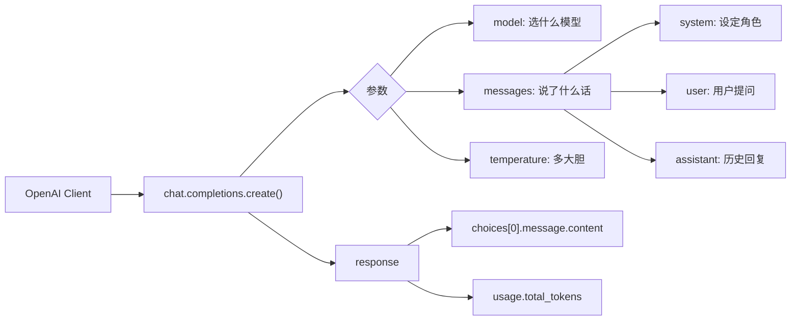

# OpenAI 库的调用

这是调用大模型 API 最核心的 Python 库。虽然名字叫 "OpenAI"，但大多数模型服务商（包括本地 Ollama）都兼容这套 API 规范，学会了它就能调用几乎所有的 LLM。

## 1. 安装

```bash
pip install openai
```

## 2. 获取客户端对象

```python
from openai import OpenAI

client = OpenAI(
    api_key="sk-xxxxxxxxxxxxxxxxxxxx",   # API 密钥
    base_url="https://api.openai.com/v1", # 模型服务商的接入地址
)
```

两个核心参数：

| 参数 | 说明 | 示例 |
|------|------|------|
| `api_key` | 身份认证密钥 | OpenAI: `sk-...`；本地 Ollama: 填什么都行（`ollama`） |
| `base_url` | 服务商的 API 端点 | OpenAI: `https://api.openai.com/v1`；Ollama: `http://localhost:11434/v1` |

> **安全提醒**：不要把 `api_key` 明文写在代码里，用环境变量（见 [1_环境变量保护APIKEY](./1_环境变量保护APIKEY.md)）。

### 连接不同服务商

```python
# OpenAI 官方
client = OpenAI(api_key="sk-xxx", base_url="https://api.openai.com/v1")

# 本地 Ollama（兼容 OpenAI API）
client = OpenAI(api_key="ollama", base_url="http://localhost:11434/v1")

# 其他兼容服务商（DeepSeek、通义千问、智谱等）
client = OpenAI(api_key="your-key", base_url="https://api.deepseek.com/v1")
```

**`base_url` 的作用**：同一套代码，换个地址就能切换模型服务商，不用改业务逻辑。

## 3. `chat.completions.create` — 核心调用方法

```python
response = client.chat.completions.create(
    model="gpt-4o",            # 调用的模型名称
    messages=[                  # 消息列表
        {"role": "system", "content": "你是一个乐于助人的助手。"},
        {"role": "user",   "content": "什么是 RAG？请用一句话解释。"},
    ],
    temperature=0.7,            # 控制随机性
    max_tokens=500,             # 限制最大输出长度
)
```

### 3.1 `model` — 模型名称

指定要调用哪个模型：

```python
model="gpt-4o"           # OpenAI 最新多模态模型
model="gpt-3.5-turbo"    # OpenAI 轻量模型
model="qwen3.5"           # 本地 Ollama 的 Qwen3.5 9B
model="deepseek-chat"     # DeepSeek API
```

### 3.2 `messages` — 消息列表

是一个**列表**，里面包含多个**字典**，每个字典有 2 个 key：

| Key | 说明 |
|-----|------|
| `role` | 消息的角色，决定这段文本是谁说的 |
| `content` | 消息的具体内容 |

#### 三种角色（role）

| role | 含义 | 用途 |
|------|------|------|
| `system` | **系统指令** | 设定 AI 的行为、角色、语气。放在 messages 第一条，优先级最高 |
| `user` | **用户** | 用户的问题或指令 |
| `assistant` | **AI 助手** | AI 之前的回复，用于多轮对话中传递上下文 |

#### 不同场景的 messages 示例

**单轮对话（最简单）**：

```python
messages = [
    {"role": "user", "content": "Python 是什么？"},
]
```

**带系统指令（控制 AI 行为）**：

```python
messages = [
    {"role": "system", "content": "你是一个 Python 专家，回答要包含代码示例。"},
    {"role": "user", "content": "怎么读取 CSV 文件？"},
]
```

**多轮对话（传入历史）**：

```python
messages = [
    {"role": "system", "content": "你是一个 Python 专家。"},
    {"role": "user", "content": "怎么读取 CSV 文件？"},
    {"role": "assistant", "content": "使用 pandas 的 read_csv() 方法..."},
    {"role": "user", "content": "那怎么只读前 10 行？"},  # AI 会结合上文理解"那"指的是 CSV
]
```

> **关键理解**：多轮对话时，每次请求都要把**完整的历史消息**发送过去，LLM 本身没有记忆。

### 3.3 其他常用参数

| 参数 | 说明 | 取值范围 | 默认 |
|------|------|----------|------|
| `temperature` | 控制随机性。**越低越确定，越高越有创意** | 0 ~ 2 | 1 |
| `max_tokens` | 限制回复的最大 token 数（控制成本） | 正整数 | 按模型 |
| `top_p` | 核采样，只从累积概率达到 p 的词中选 | 0 ~ 1 | 1 |
| `stream` | 是否流式输出（逐字返回，像打字效果） | `True` / `False` | `False` |

```python
# 严谨任务（代码生成、数学、事实问答）→ 低 temperature
response = client.chat.completions.create(
    model="gpt-4o",
    messages=[{"role": "user", "content": "写一个快速排序的 Python 实现"}],
    temperature=0.1,   # 很确定，几乎每次结果一样
)

# 创意任务（写作、头脑风暴）→ 高 temperature
response = client.chat.completions.create(
    model="gpt-4o",
    messages=[{"role": "user", "content": "写一首关于编程的诗"}],
    temperature=1.2,   # 有创意，每次结果不同
)
```

## 4. 返回结果 — 类 JSON 对象

`response` 是一个对象，访问方式如下：

```python
response = client.chat.completions.create(
    model="gpt-4o",
    messages=[{"role": "user", "content": "你好"}],
)

# 提取回复文本（最常用！）
print(response.choices[0].message.content)
# → "你好！有什么我可以帮助你的吗？"

# 查看完整对象结构
print(response.model_dump_json(indent=2))
```

### response 核心字段

| 路径 | 说明 |
|------|------|
| `response.choices[0].message.content` | **回复的文本内容**（最常用） |
| `response.choices[0].message.role` | 角色，固定为 `"assistant"` |
| `response.choices[0].finish_reason` | 结束原因：`"stop"`（正常）、`"length"`（达到 max_tokens） |
| `response.model` | 实际使用的模型名称 |
| `response.usage.prompt_tokens` | 输入消耗的 token 数 |
| `response.usage.completion_tokens` | 输出消耗的 token 数 |
| `response.usage.total_tokens` | 总消耗 token 数 |

### 完整的 JSON 返回结构

```json
{
  "id": "chatcmpl-xxx",
  "object": "chat.completion",
  "created": 1711234567,
  "model": "gpt-4o-2024-05-13",
  "choices": [
    {
      "index": 0,
      "message": {
        "role": "assistant",
        "content": "你好！有什么我可以帮助你的吗？"
      },
      "finish_reason": "stop"
    }
  ],
  "usage": {
    "prompt_tokens": 10,
    "completion_tokens": 12,
    "total_tokens": 22
  }
}
```

## 5. 流式输出（Streaming）

像 ChatGPT 网页版那样逐字显示：

```python
stream = client.chat.completions.create(
    model="gpt-4o",
    messages=[{"role": "user", "content": "写一首五言绝句"}],
    stream=True,  # 开启流式
)

for chunk in stream:
    content = chunk.choices[0].delta.content
    if content:
        print(content, end="", flush=True)
```

`stream=True` 时，每个 `chunk` 里是增量内容（`delta.content`），而不是完整的 `message.content`。

## 6. 完整示例：连接本地 Ollama

把以上所有知识串起来，调用本机的 `qwen3.5` 模型：

```python
from openai import OpenAI

# 连接本地 Ollama
client = OpenAI(
    api_key="ollama",                      # Ollama 不校验 key，随便填
    base_url="http://localhost:11434/v1",  # Ollama 兼容 OpenAI API 的端点
)

response = client.chat.completions.create(
    model="qwen3.5",                       # 你本机已下载的模型
    messages=[
        {"role": "system", "content": "你是一个 Python 编程助手。请用中文回答。"},
        {"role": "user", "content": "用一句话解释什么是装饰器？"},
    ],
    temperature=0.3,
)

print(response.choices[0].message.content)
print(f"\n消耗 token: {response.usage.total_tokens}")
# 本地模型调用不花钱！只是消耗本机 GPU 算力
```

## 总结



OpenAI 库的调用模式可以总结为一句话：**创建一个 Client，调 `create` 方法，传入 model + messages，从 response 中取 content**。

`base_url` 是切换服务商的钥匙，`messages` 是对话的灵魂，`temperature` 是控制风格的手柄。掌握这三个，就能调用任何兼容 OpenAI API 的模型。
