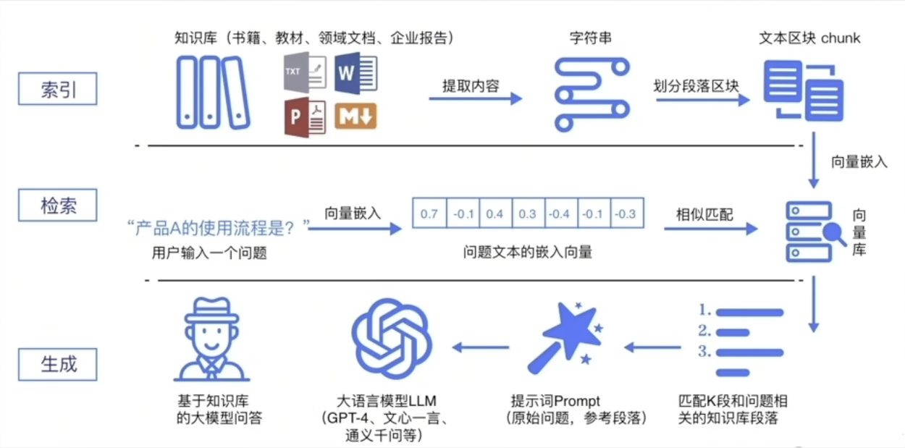

# LangChain & RAG 简介

## LangChain 概述

LangChain是围绕大语言模型建立的框架，它的核心理念是为各种大模型实现通用的接口。

```plaintext
    # 这里使用langchain要安装这些包
    pip install langchain langchain-community langchain-ollama dashscope chromadb
```
- langchain:核心包
- langchain-community: 社区支持包,提供了更多的第三方模型调用(我们用的阿里云千问模型就需要这个包)
- langchain-ollama: Ollama支持包,支持调用Ollama托管部署的本地模型
- dashscope:阿里云通义千问的Python SDK
- chromadb:轻量向量数据库(后续使用)

## 主要功能

### 1. 优化提示词(提示词工程)
- 提供模板化的提示词管理
- 支持提示词的版本控制和优化
- 实现提示词的动态组装

### 2. 调用各种模型
- 统一的接口对接多种 LLM（OpenAI、Claude、Llama 等）
- 支持本地和云端模型
- 模型切换和比较变得简单

### 3. 管理会话的历史记录
- 记录和存储对话上下文
- 支持 Token 计数和自动截断
- 实现对话的持久化和恢复

### 4. 管理和分析各类文档
- 文档加载器（PDF、Word、网页、数据库等）
- 文本分割器和预处理
- 向量化存储和检索

### 5. 构建功能的执行链条
- 将多个组件串联成工作流
- 支持顺序、并行、条件分支等执行模式
- 链条可复用和组合

### 6. 构建智能体
- 赋予模型工具调用能力
- 支持自主决策和行动
- 实现 ReAct（推理+行动）模式

## RAG (检索增强生成) 简介

大模型现在有四大问题：
1. 领域知识缺乏：大模型的知识来源于训练数据无法覆盖特定的领域
2. 过时的信息：模型的知识不是训练，不具备自动更新知识的能力
3. 幻觉问题：大语言模型有时会在回答中生成看似合理，但实际上是错误的信息
4. 数据的安全性

**核心思想**：检索增强生成技术，利用检索外部文档提升生成结果的质量 **RAG = 检索技术 + LLM提示** ,具体的流程请看

### RAG 工作流程

1. **文档准备** → 加载、分割、向量化
2. **索引构建** → 存储向量到向量数据库
3. **用户提问** → 查询相关文档片段
4. **上下文组装** → 将问题+相关文档作为提示词
5. **生成回答** → LLM 基于上下文生成准确回答


## 简单总结

**LangChain** 是一个开发框架，提供了构建 LLM 应用所需的全部工具和抽象，让开发者能够快速构建复杂的 AI 应用。

**RAG** 是一种技术模式，通过检索外部知识来增强 LLM 的能力，是 LangChain 的重要应用场景之一。

两者的结合让开发者能够快速构建具有知识库功能的智能问答系统。