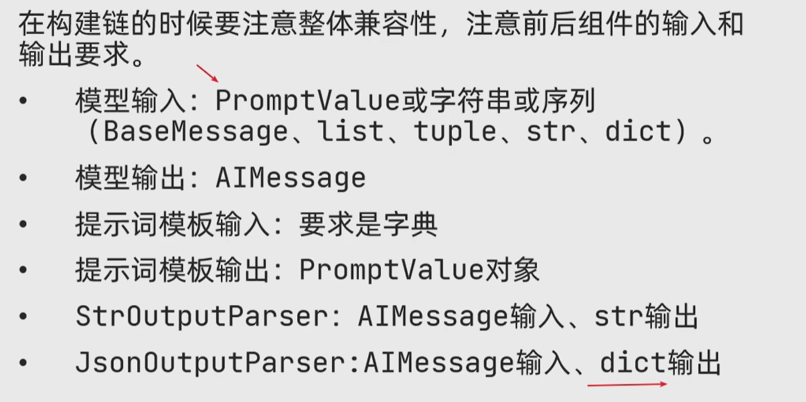

# Chain 链

**将组件串联，上一个组件的输出作为下一个组件的输入**，是 LangChain 中 Chain 的核心工作原理。

最常见的写法：

```python
chain = prompt | model
```

这里的 `|` 是 LangChain Expression Language（LCEL）的链式组合语法。它会把左边组件的输出自动传给右边组件。

## 1. Chain 的作用

不用 Chain 时，需要手动分步骤调用：

```python
prompt_value = prompt.invoke({"question": "什么是 RAG？"})
res = model.invoke(prompt_value)
print(res.content)
```

使用 Chain 后，可以把流程组合成一个整体：

```python
chain = prompt | model
res = chain.invoke({"question": "什么是 RAG？"})
print(res.content)
```

Chain 的核心价值：

- 把多个组件组合成一个可调用对象
- 自动传递中间结果
- 让提示词、模型、解析器、检索器等组件协同工作
- 代码更清晰，便于复用

## 2. Chain 的本质

新版 LangChain 更推荐使用 LCEL 组合链，而不是旧版 `LLMChain`。

可以这样理解：

```text
Chain = Runnable 组件 + Runnable 组件 + Runnable 组件
```

例如：

```python
chain = prompt | model | parser
```

执行流程：

```text
输入变量
  ↓
PromptTemplate / ChatPromptTemplate
  ↓
模型 Model
  ↓
OutputParser
  ↓
最终结果
```

## 3. Runnable 基类

`Runnable` 是 LangChain 中“可运行组件”的统一接口。

只有实现了 Runnable 接口的对象，才能自然放进链里：

```python
chain = runnable_1 | runnable_2 | runnable_3
```

常见 Runnable 组件：

| 组件 | 作用 |
| --- | --- |
| `PromptTemplate` | 普通提示词模板 |
| `ChatPromptTemplate` | 聊天提示词模板 |
| `ChatModel` / `LLM` | 大语言模型 |
| `StrOutputParser` | 把模型输出转成字符串 |
| `JsonOutputParser` | 把模型输出解析成 JSON / dict |
| `RunnableLambda` | 把普通 Python 函数包装成 Runnable |
| `RunnablePassthrough` | 原样传递输入 |

`Runnable` 的好处是：不同组件都可以使用统一的调用方式。

## 4. 常用调用方法

### invoke：普通调用

`invoke()` 是最常用的方法，输入一份数据，返回一个结果。

```python
res = chain.invoke({"question": "什么是 Chain？"})
print(res.content)
```

如果链最后接了 `StrOutputParser`，返回值就是普通字符串：

```python
chain = prompt | model | StrOutputParser()
res = chain.invoke({"question": "什么是 Chain？"})
print(res)
```

### stream：流式输出

`stream()` 会边生成边返回，适合聊天界面或命令行实时输出。

```python
for chunk in chain.stream({"question": "写一首诗"}):
    print(chunk.content, end="", flush=True)
```

如果链最后接了 `StrOutputParser`，流式 chunk 通常就是字符串：

```python
for chunk in chain.stream({"question": "写一首诗"}):
    print(chunk, end="", flush=True)
```

## 5. RunnableSequence：顺序链

使用 `|` 连接多个组件时，LangChain 会把它们组合成顺序链。

```python
chain = prompt | model | parser
```

含义：

```text
prompt 的输出 -> model 的输入
model 的输出 -> parser 的输入
```

结合当前代码：

```python
chat_prompt_template = ChatPromptTemplate.from_messages([
    ("system", "你是一个诗人，可以作诗。"),
    MessagesPlaceholder("history"),
    ("human", "请再来一首诗"),
])

model = ChatTongyi(model="qwen3-max")

chain = chat_prompt_template | model
```

执行流程：

```text
{"history": history_data}
  ↓
ChatPromptTemplate 填充历史消息
  ↓
ChatTongyi 调用模型
  ↓
返回 AIMessage
```

## 6. RunnablePassthrough：保留原始输入

`RunnablePassthrough` 表示原样传递输入。

在 RAG 中很常见：一边把问题交给检索器，一边保留原始问题。

```python
from langchain_core.runnables import RunnablePassthrough

rag_input = {
    "context": retriever,
    "question": RunnablePassthrough(),
}
```

含义：

```text
用户问题 -> retriever -> context
用户问题 -> 原样保留 -> question
```

然后继续传给提示词模板：

```python
rag_chain = rag_input | prompt | model | StrOutputParser()
```

## 7. RunnableLambda：自定义处理逻辑

如果中间需要自己写一点处理逻辑，可以用 `RunnableLambda` 把普通函数包装成 Runnable。

```python
from langchain_core.runnables import RunnableLambda

def get_content(msg):
    return msg.content

chain = prompt | model | RunnableLambda(get_content)
```

常见用途：

- 提取 `AIMessage.content`
- 清洗字符串
- 把上一步输出转换成下一步需要的格式

不过如果只是把模型输出转成字符串，更推荐直接使用 `StrOutputParser`。

## 8. Chain 的输入输出要匹配

写 Chain 时要注意：上一个组件的输出，必须能被下一个组件接收。

例如：

```python
chain = prompt | model
```

这里能工作，是因为：

```text
prompt 输出 PromptValue
model 可以接收 PromptValue
```

再例如：

```python
chain = prompt | model | StrOutputParser() | model
```

这里能工作，是因为：

```text
第一个 model 输出 AIMessage
StrOutputParser 把 AIMessage 转成 str
第二个 model 可以接收 str
```

## 9. StrOutputParser 解析器

大模型返回的结果通常不是普通字符串，而是 `AIMessage`。

`StrOutputParser` 的作用是：**把模型输出解析成字符串**。

```python
from langchain_core.output_parsers import StrOutputParser

parser = StrOutputParser()
chain = prompt | model | parser

res = chain.invoke({"question": "什么是 LangChain？"})
print(res)
```

如果后面还要接另一个模型，`StrOutputParser` 很有用：

```python
chain = prompt | model | StrOutputParser() | model
```

执行流程：

```text
PromptTemplate
  ↓
第一个模型生成 AIMessage
  ↓
StrOutputParser 转成字符串
  ↓
第二个模型继续处理这个字符串
```

对应代码：[12_StrOutputParser解析器.py](../Codes/12_StrOutputParser解析器.py)

具体图例请参考

## 10. JsonOutputParser 解析器

有时我们不希望模型只返回一段自然语言，而是希望它返回结构化数据，例如：

```python
{
    "name": "张景行",
    "reason": "寓意前程远大，品行高洁"
}
```

这时可以使用 `JsonOutputParser`，把模型输出解析成 Python 字典。

```python
from langchain_core.output_parsers import JsonOutputParser
from langchain_core.prompts import PromptTemplate

parser = JsonOutputParser()

prompt = PromptTemplate.from_template(
    "请给一个姓{name}的{gender}宝宝起名，"
    "只返回 JSON，字段包含 name 和 reason。"
)

chain = prompt | model | parser

res = chain.invoke({"name": "张", "gender": "男"})
print(res["name"])
print(res["reason"])
```

执行流程：

```text
PromptTemplate 生成提示词
  ↓
模型返回 JSON 格式文本
  ↓
JsonOutputParser 解析成 dict
  ↓
程序可以按字段读取结果
```

注意：`JsonOutputParser` 能否成功，取决于模型是否真的按 JSON 格式输出。因此提示词里要明确要求“只返回 JSON”。
对应代码：[13_StrOutputParser解析器.py](../Codes/13_JSONOutputParser解析器.py)

