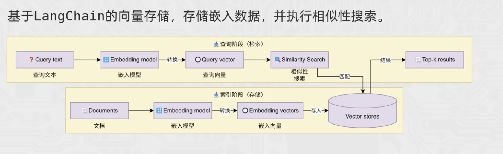

# LangChain 向量存储技术

向量存储用于保存文档的 embedding，并根据语义相似度检索相关内容，是 RAG 的核心组件。原理可参考：

## 1. 基本流程

1. 文档切分为多个 chunk。
2. embedding 模型将 chunk 转换为向量。
3. 保存向量、原文和 metadata。
4. 将用户问题转换为向量，检索最相似的 `k` 个 chunk。
5. 把检索结果作为上下文交给大模型。

## 2. 常用操作

- 新增：`add_documents(documents, ids=...)`
- 删除：`delete(ids=...)`
- 检索：`similarity_search(query, k=...)`
- 带分数检索：`similarity_search_with_score(...)`
- 转为检索器：`as_retriever(...)`，便于接入 RAG 链

建议给每个文档设置稳定且唯一的 ID，方便更新和删除；metadata 可记录来源、类别、时间等信息，用于过滤检索结果。

## 3. 存储方式

- `InMemoryVectorStore`：数据保存在内存，程序重启后丢失，适合学习和测试。
- `Chroma`：可持久化到本地目录，适合小型项目和原型。
- 生产环境：根据数据量、并发、权限隔离和运维成本选择专用向量数据库。

## 4. 注意点

- 写入和查询必须使用同一个 embedding 模型及向量维度。
- `k` 太小可能漏掉信息，太大会引入噪声并增加 Token 消耗。
- 检索效果不仅取决于数据库，还受 chunk 大小、重叠长度和 embedding 模型影响。
- 向量存储负责“找资料”，大模型负责“结合资料生成回答”。
