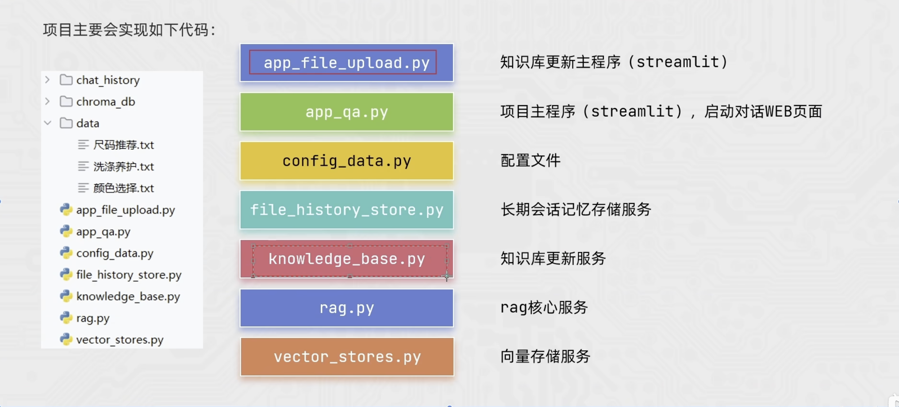
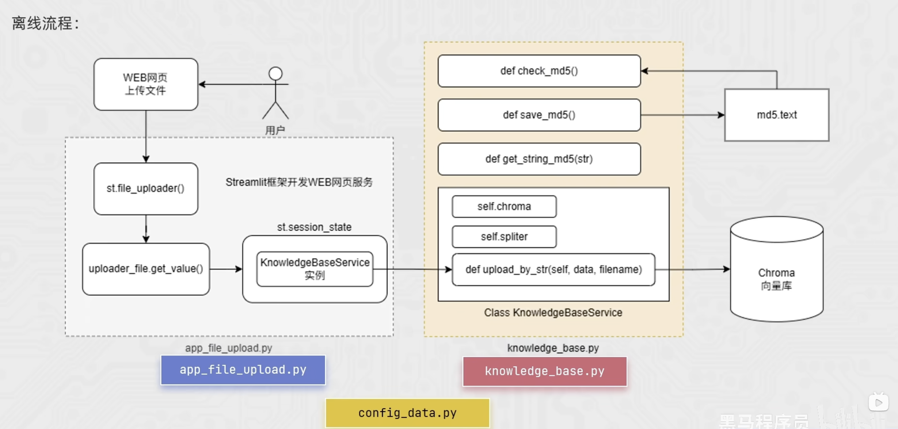
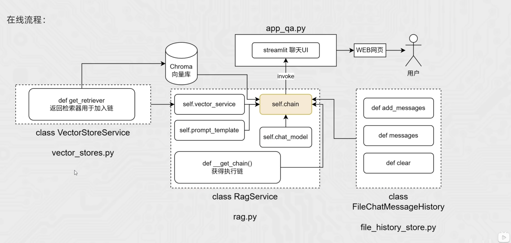

# 服装商品智能客服

## 项目简介

本项目是一个基于 **LangChain + RAG（Retrieval-Augmented Generation，检索增强生成）** 的服装领域智能客服系统。系统将商家提供的服装知识文档转换为向量并持久化存储；当用户提问时，先从知识库中检索相关内容，再将检索结果与问题一起交给大语言模型，从而生成更准确、更符合业务知识的回答。

当前知识库包含以下三类数据：

- 尺码推荐：根据身高、体重推荐参考尺码。
- 颜色选择：根据肤色、场合、体型和季节给出搭配建议。
- 洗涤养护：针对不同季节和服装材质提供洗涤、晾晒与收纳建议。

> 注：尺码推荐仅作为通用参考，实际尺码还会受品牌版型、款式和个人穿着偏好影响，应优先以具体商品的尺码表为准。

## 项目目标

1. 支持通过 Web 页面上传商品知识文件，降低知识库维护成本。
2. 对文档进行解析、切分、向量化和持久化存储。
3. 通过 MD5 校验防止同一文件被重复入库。
4. 根据用户问题召回相关知识片段，为模型回答提供可靠上下文。
5. 提供对话式客服页面，并预留长期会话记忆能力。

## 总体架构

规划中的主要模块及职责如下：

| 模块 | 职责 |
| --- | --- |
| `app_file_uploader.py` | Streamlit 知识库更新页面，接收用户上传的文件 |
| `app_qa.py` | Streamlit 对话主页，接收问题并展示回答 |
| `config_data.py` | 统一管理模型、路径、切分参数和检索参数等配置 |
| `file_history_store.py` | 存储和读取长期会话记录 |
| `knowledge_base.py` | 完成文档解析、MD5 去重、文本切分和知识入库 |
| `rag.py` | RAG 核心服务，负责检索、Prompt 组装和模型调用 |
| `vector_stores.py` | 封装向量库的初始化、写入和检索操作 |
| `data/` | 存放尺码、颜色和洗护等原始知识文档 |
| `chroma_db/` | Chroma 向量数据的本地持久化目录 |
| `chat_history/` | 本地会话历史持久化目录 |

## 离线流程：构建与更新知识库

1. 用户在 Streamlit 页面中选择并上传知识文件。
2. 后端读取文件内容，并计算文件内容的 MD5 摘要。
3. 通过 `check_md5()` 在历史摘要记录中查询：
   - 摘要已存在：说明相同内容已入库，跳过本次处理。
   - 摘要不存在：继续解析和入库。
4. 根据文件类型解析文本，清理空白字符等无效内容。
5. 使用文本切分器将长文档分成多个可检索的 chunk，并保留文件名、来源等 metadata。
6. 使用 Embedding 模型将各文本块转换为向量。
7. 通过 `KnowledgeBaseService` 将文本、向量和 metadata 写入 Chroma。
8. 只有全部文本块成功入库后，才通过 `save_md5()` 保存摘要，避免入库失败却被误标记为已处理。

MD5 在这里用于文件内容去重，不用于密码存储或安全签名。建议以文件字节而非文件名计算摘要：文件改名不会重复入库，而同名文件内容变更后仍可重新入库。

## 在线流程：用户问答

在线问答由 `VectorStoreService`、`FileChatMessageHistory` 和 `RagService` 三个核心组件协同完成：

| 组件 | 作用 |
| --- | --- |
| `VectorStoreService` | 连接 Chroma 向量库，并通过 `get_retriever()` 返回可加入 RAG 链的检索器 |
| `FileChatMessageHistory` | 提供 `messages`、`add_messages()` 和 `clear()`，负责读取、追加和清空会话历史 |
| `RagService` | 组合检索器、Prompt、聊天模型与历史记录，构建最终的可执行问答链 `self.chain` |
| `app_qa.py` | 提供 Streamlit 聊天界面，接收用户问题、调用问答链并展示结果 |

一次完整的问答过程如下：

1. 系统初始化 `VectorStoreService`，连接已经持久化的 Chroma 向量库，并取得检索器。
2. `RagService` 在 `__get_chain()` 中将检索器、`self.prompt_template` 和 `self.chat_model` 组装为 `self.chain`，同时接入 `FileChatMessageHistory` 以支持多轮对话。
3. 用户通过 `app_qa.py` 提供的 Streamlit 页面输入问题，页面调用 `self.chain.invoke()` 发起请求。
4. 检索器将问题向量化，并从 Chroma 中召回与问题最相关的知识片段。
5. 问答链把检索结果、当前问题和必要的历史消息填充到 Prompt 中，再交给聊天模型生成回答。
6. Streamlit 页面将回答展示给用户，`FileChatMessageHistory` 同步保存本轮消息，为后续对话提供上下文。

如果知识库没有召回足够可靠的内容，模型应明确说明依据不足，避免脱离知识库编造答案。

## 关键设计说明

### 文本切分

文本块太大会引入无关内容，太小又容易丢失语义上下文。项目应在配置中集中管理 `chunk_size` 和 `chunk_overlap`，并通过实际问题调整。对尺码表等结构化程度较高的短文本，应尽量保持一条完整规则不被拆散。

### Metadata

每个文本块建议至少保存 `source`、`filename`、`category` 和 `chunk_id`。这些信息既可用于过滤检索，也可在回答中展示知识来源，方便排查错误。

### 知识更新

MD5 只能判断“内容是否完全一致”。如果后续需要支持文档覆盖、删除或版本回滚，建议同时记录文档 ID、版本号、入库时间和对应的向量 ID 列表。

### 对话记忆

短期记忆可保存当前 Streamlit Session 中的对话；长期记忆则需要为用户或会话分配唯一 ID，再将历史消息持久化。为避免 Prompt 过长，可仅加载最近若干轮对话，或先对较早内容进行摘要。

### 后期升级

可以考虑将当前的 Chroma 向量库替换为更适合大规模 RAG 场景的 Milvus，以提升海量数据下的检索性能和扩展能力。
